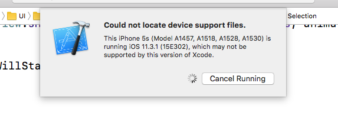

# xcode-images
Xcode Device Support Images for new iOS Versions. Current support up to iOS 14.8

Fixes problem "Could Not Locate Device Support Files" for newer iOS devices




Run the following script to automatically download and install missing Xcode Developer Support Images 

# Usage

Execute the install script

```
bash <(curl -s https://raw.githubusercontent.com/fraigo/xcode-images/master/install)
```

And select the image version to install

```
Current versions installed:
10.0		11.0		11.3 (15E5178d)	8.0		8.4		9.3
10.1		11.1		11.4		8.1		9.0		__MACOSX
10.2		11.2		12.0 (16A366)	8.2		9.1
10.3		11.3		12.1 (16B5059d)	8.3		9.2

Current versions available to install:
11.3
12.0
12.1
13.5
14.1
14.6
14.7
14.7.1
14.8

Which image to install? : 14.8
```

The image will be downloaded and then installed in 

```
/Applications/Xcode.app/Contents/Developer/Platforms/iPhoneOS.platform/DeviceSupport/
```

Close all XCode windows if it's already running, and restart Xcode. 
After the first attempt of running your device again, you will receive a notification like this:


After preparing your phone for debugging, you will be able to run and debug your applications in your updated device.

